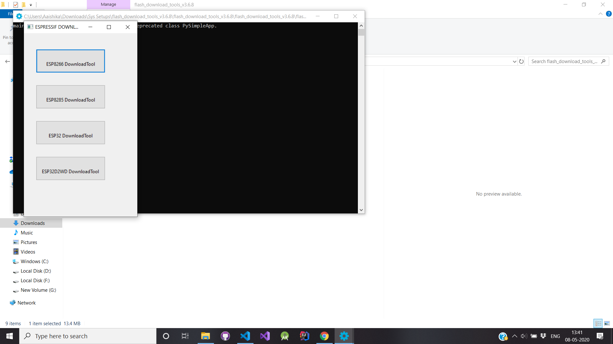
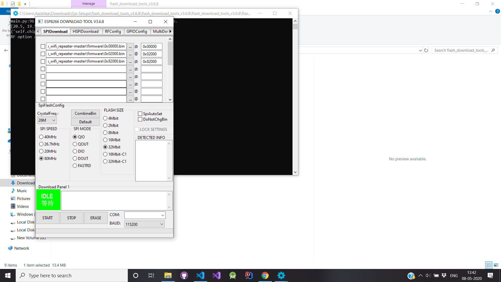
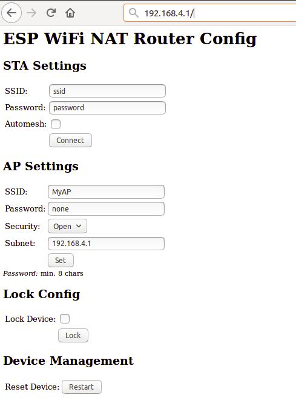

# WiFi Repeater

This is an implementation of a WiFi Repeater or a WiFi NAT router on the ESP8266 and ESP8285 based on a repository by [martin-ger](https://github.com/martin-ger/esp_wifi_repeater).   

Using this repository you would be able to create **Simple Range Extender for an Existing WiFi Network** . For upgraded use case scenarios based on this head over to this [link](https://github.com/martin-ger/esp_wifi_repeater).

## Requirements

- A NodeMCU Board (ESP8266 Chip Based Microcontroller)
- Flash Download Tools. Download it from [here](https://www.espressif.com/en/tools-type/flash-download-tools).
- BIN Files in this Repository

## Steps to Make a Simple WiFi Repeater

- Download the following files in the Firmware Folder.

| File Name | Download Link |
| --- | --- |
| 0x00000.bin | [Download](firmware/0x00000.bin) |
| 0x02000.bin | [Download](firmware/0x02000.bin) |
| 0x82000.bin | [Download](firmware/0x82000.bin) |

- Download Flash Download Tools. Launch it. The Application will look something like this.

- Click on the three dots (...) to link the BIN files and add the name of the file (without the extension) in the input box adjacent to it. Add the files in the following manner with the setting as given.

- Connect NodeMCU Board and select COM Port set the BAUD Rate as 115200.
- Once done, click on Start.
- After you're done with it, close the application and power up the board.

## First Boot

- The Repeater starts with the following default configuration:
  - ap_ssid: MyAP, ap_password: none, ap_on: 1, ap_open: 1
  - network: 192.168.4.0/24
- After first boot (or factory reset) it will offer a WiFi network with an open AP and the ssid "MyAP". It does not yet try to automatically re-connect to an uplink AP (as it does not know a valid ssid or password).
- Connect to this WiFi network and do the basic configuration either via a simple web interface or the full config with all options via the console.
- Point your browser to "http://192.168.4.1".

- First enter the appropriate values for the uplink WiFi network, the "STA Settings".
- Use password "none" for open networks. Check the "Automesh" box if and only if you really want to use the automesh mode. Click "Connect".
- The ESP reboots and will connect to your WiFi router. The status LED should be blinking after some seconds.
- If you like, you can mark the "lock" checkbox and click "Lock". Now the config cannot be changed anymore without first unlocking it with the uplink WiFi network's password (define one even if the network is open).
- If you made a mistake and have lost all contact with the ESP you can still use the serial console to recover it.

## For Command Line Interface

Advanced configuration has to be done via the command line on the console interface. This console is available either via the serial port at 115200 baud or via tcp port 7777 (e.g. "telnet 192.168.4.1 7777" from a connected STA).

Use the following commands for an initial setup:

- set ssid your_home_router's_SSID
- set password your_home_router's_password
- set ap_ssid ESP's_ssid
- set ap_password ESP's_password
- show (to check the parameters)
- save
- reset

Again, if you want to enter non-ASCII or special characters you can use HTTP-style hex encoding (e.g. "My%20AccessPoint") or, only on the CLI, as shortcut C-style quotes with backslash (e.g. "My\ AccessPoint"). Both methods will result in a string "My AccessPoint".

## For Advanced Settings

Visit @martin-ger 's Repository [here](https://github.com/martin-ger/esp_wifi_repeater).

## Collaborators

- [@martin-ger](https://github.com/martin-ger/)
- [@aaishikasb](https://github.com/aaishikasb/)
